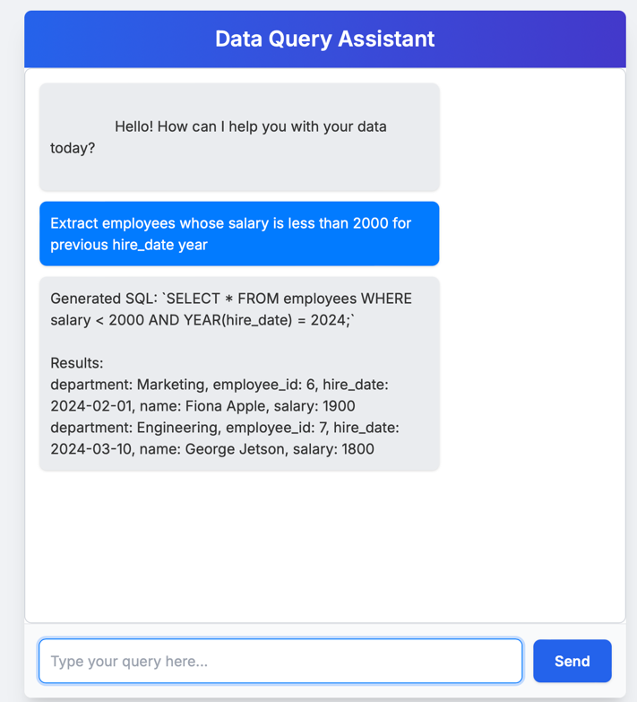

# LLM Powered Data Extractor & Query System

This project implements a multi-component system that allows users to interact with a database using natural language queries through a chat interface. It features an intelligent Host server that uses LLM-based tool calling to interact with a specialized MCP (Model Context Protocol) aligned data processing server.


## Project Architecture

The system consists of the following main components:

1.  **MCP Server (Data Backend)**:
    * Built with FastAPI and leveraging the `FastMCP` library from the Model Context Protocol.
    * Connects to a MySQL database.
    * Exposes data operations (like natural language to SQL, table listing, data upload) as "tools" via `/tools` and `/invoke_tool` endpoints.
    * Uses an LLM (via `llm_integration.py` with LangGraph) for complex tasks like natural language to SQL conversion.
    * Handles file uploads (CSV/Excel) for table creation and data population via a dedicated `/upload_file` endpoint.

2.  **Host Server (Application Backend & UI Host)**:
    * A Flask application that serves the client-side chat UI.
    * Acts as an intelligent intermediary between the user and the MCP Server.
    * Uses LangGraph and an LLM (e.g., OpenAI's GPT models) to:
        * Fetch available tools from the MCP Server's `/tools` endpoint.
        * Understand user intent from chat messages.
        * Decide which MCP tool to call and with what arguments.
        * Invoke the chosen tool on the MCP Server (primarily via its `/invoke_tool` endpoint).
        * Format the MCP Server's response and send it back to the chat UI.

3.  **Client UI (Chat Interface)**:
    * A simple HTML, CSS, and JavaScript single-page application.
    * Provides a chat interface for users to input natural language queries.
    * Served by the Host Server.

4.  **MySQL Database**:
    * The primary data store.
    * Managed using Docker and Docker Compose for easy setup.

## Features

* **Natural Language Database Querying**: Users can ask questions in plain English (e.g., "show me employees with salary over 50000").
* **Tool-Based Architecture**: The MCP Server exposes its functionalities as discoverable tools, and the Host Server intelligently selects and uses these tools.
* **Dynamic SQL Generation**: The MCP Server uses an LLM to convert natural language queries into SQL.
* **Data Upload & Table Management**:
    * Upload CSV/Excel files to create new tables or populate existing ones.
    * Table schema is inferred from uploaded files if the table is new.
* **Table Discovery**: Users can ask about available tables and their schemas.
* **Modular Design**: Separate components for data processing (MCP Server), application logic/UI hosting (Host Server), and database.
* **Protocol-Aligned MCP Server**: The data backend is designed using `FastMCP` for standardized tool definition and invocation.

## Project Structure (Illustrative)


llm_powered_data_extractor/
├── mcp_server/ # MCP (Data Backend) Server files
│ ├── mcp_fastapi_server.py # Main FastAPI/FastMCP application
│ ├── config.py # Configuration (DB credentials, etc.)
│ ├── db_utils.py # MySQL database interaction utilities
│ ├── llm_integration.py # LangGraph/Langchain for SQL generation (used by MCP)
│ ├── file_handler.py # (Needs refactoring for FastAPI UploadFile)
│ └── .env # Environment variables (DB, OPENAI_API_KEY)
│
├── host_server/ # Host (Application Backend & UI) Server files
│ ├── host_server.py # Main Flask/LangGraph application
│ ├── templates/
│ │ └── index.html # Client chat UI
│ └── .env # (Can also have its own .env if needed, e.g. for Host's own LLM key if different)
│
├── mysql-docker-compose.yml # Docker Compose for MySQL
├── requirements_mcp.txt # Python dependencies for MCP Server
├── requirements_host.txt # Python dependencies for Host Server
└── README.md # This file
*(Note: You might choose to have a single top-level `.env` and `requirements.txt` if preferred, and adjust import paths accordingly.)*

## Prerequisites

* Python 3.9+
* Docker and Docker Compose
* An OpenAI API Key (for LLM functionalities in both MCP and Host servers)
* Access to the `modelcontextprotocol` library (e.g., via `pip install modelcontextprotocol`)

## Setup Instructions

### 1. Environment Variables

Create a `.env` file in the `mcp_server/` directory (or your project root if you centralize it). Populate it with your credentials:

```env
# .env for MCP Server (and potentially Host Server)

# --- MySQL Database Configuration ---
MYSQL_HOST=127.0.0.1
MYSQL_PORT=3306
MYSQL_USER=mcp_user
MYSQL_PASSWORD=mcp_password
MYSQL_DATABASE=user_data_db

# --- OpenAI API Configuration ---
OPENAI_API_KEY=your_actual_openai_api_key_here

# --- Server Port Configurations (Optional, can be overridden) ---
MCP_SERVER_PORT=5001
HOST_SERVER_PORT=5000


(The config.py in the MCP server loads these. The Host server might also need access to OPENAI_API_KEY.)
2. MySQL Database Setup
Navigate to the directory containing mysql-docker-compose.yml.
Run the MySQL container:
docker-compose -f mysql-docker-compose.yml up -d

This will start a MySQL server accessible on localhost:3306.
3. MCP Server (FastAPI based)
Navigate to the mcp_server/ directory.
Create and activate a Python virtual environment:
python -m venv venv_mcp
source venv_mcp/bin/activate  # Linux/macOS
# venv_mcp\Scripts\activate    # Windows


Install dependencies (create a requirements_mcp.txt first):
# requirements_mcp.txt
fastapi
uvicorn[standard]
pydantic>=1.8,<2.0 # Or pydantic for v2, adjust mcp_fastapi_server.py if using v2 Pydantic features
modelcontextprotocol # Or the specific package name for FastMCP
werkzeug
python-dotenv
mysql-connector-python
openai>=1.0.0
langchain>=0.1.0
langchain-openai>=0.1.0
langgraph>=0.0.30 # Ensure this version or newer
pandas
openpyxl
```bash
pip install -r requirements_mcp.txt


Important: Refactor file_handler.py to work with FastAPI's UploadFile as noted in the comments within mcp_fastapi_server.py. The current file_handler.py (if based on previous Flask versions) will not work directly.
Run the MCP Server:
python mcp_fastapi_server.py

It should start on http://localhost:5001 (or the port specified in .env/config.py).
4. Host Server (Flask based)
Navigate to the host_server/ directory.
Create and activate a Python virtual environment:
python -m venv venv_host
source venv_host/bin/activate  # Linux/macOS
# venv_host\Scripts\activate    # Windows


Install dependencies (create a requirements_host.txt first):
# requirements_host.txt
Flask
requests
openai>=1.0.0
langchain>=0.1.0
langchain-openai>=0.1.0
langgraph>=0.0.30
python-dotenv # If host_server.py loads .env directly
```bash
pip install -r requirements_host.txt


Ensure the templates/index.html file exists within the host_server/ directory.
Run the Host Server:
python host_server.py

It should start on http://localhost:5000 (or the port specified in .env).
Running the Application
Ensure MySQL is running (Step 2).
Start the MCP Server (Step 3). Wait for it to initialize and register tools.
Start the Host Server (Step 4).
Open your web browser and navigate to http://localhost:5000.
You should see the chat interface. You can now interact with your data by typing natural language queries.
Key Files to Note
mcp_server/mcp_fastapi_server.py: The core data processing backend using FastMCP.
mcp_server/llm_integration.py: Handles the LLM logic for SQL generation within the MCP server.
host_server/host_server.py: The application logic server that uses LangGraph for tool calling.
host_server/templates/index.html: The user-facing chat interface.
mysql-docker-compose.yml: For running the database.
.env: For storing sensitive credentials and configurations.
Important Considerations & TODOs
Refactor file_handler.py: This is critical for the file upload functionality in the mcp_fastapi_server.py to work correctly with FastAPI's UploadFile.
Error Handling: Enhance error handling across all components for robustness.
Security: Implement proper security measures (authentication, authorization, input sanitization) if deploying to a non-local environment.
Pydantic Versions: Be mindful of Pydantic v1 vs v2 syntax if you upgrade. The current server aims for v1 compatibility for Field(default_factory=...) and __fields__.
modelcontextprotocol Library: Ensure you have the correct version and that the import paths for `Fast
